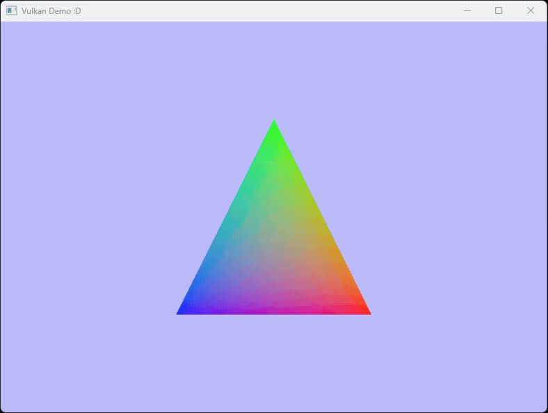

# A Vulkan Triangle
Hey!! This is a very, but very simple vulkan triangle that I made in the last 2 days. The triangle revolves and rotates around the Y axis.

It is made fully in C (specifically compatible with C99+?), although I had planned to use C++ but it had no benifit, at least for me... (also having designated initializers when I don't use C++26 was an actual benifit from C)

It only supports Windows, since windowing is made using the win32 api, although portability has been made pretty easy (you just have to implement 3 PLT_ functions) so I'm thinking on porting to X11 systems after too (using Xlib or XCB)

###### It supports X11 systems now under Xlib! So you can use this application on Linux! (For most systems which support X11)

## Requirements

All you need are 3 things! Nothing else:
    
- A C compiler, it can be anything. But MSVC's clang was used to compile this
- The Vulkan SDK
- Platform dependencies:
    - The Windows SDK (for Windows)
    - Or X11's development libraries (`libx11-dev` on most package managers)

---

This is it! You might not be able to run the compiled program since this was programmed very horribly and there are barely any device-specific checks made to make sure it works correctly on any device.

You know what can I say though... BUT IT WORKS ON MYY MACHIIIIINNNEEEEE....

